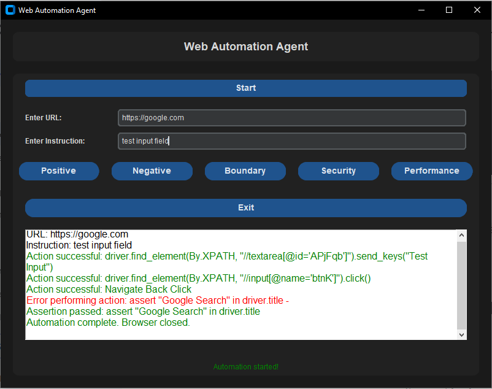

# Web Automation AI

Web Automation AI is a powerful tool designed to automate web-based tasks and workflows based on user instructions. It leverages AI to interpret user commands and perform actions such as filling forms, clicking buttons, navigating pages, and extracting data. This tool is ideal for streamlining repetitive web tasks, testing web applications, and enhancing productivity.

# Description

Web Automation AI is a Python-based tool that uses AI and web automation libraries (e.g., Selenium, BeautifulSoup) to interact with web applications. It can:

    Automate repetitive tasks: Perform actions like form filling, button clicking, and data extraction.

    Interpret user instructions: Use natural language processing (NLP) to understand and execute user commands.

    Support multiple browsers: Work with Chrome, Firefox, Edge, and more.

    Generate reports: Provide logs and reports of automated tasks for review.

# Key Features

    AI-Powered Automation: Understands natural language instructions.

    Cross-Platform: Works on Windows, macOS, and Linux.

    Customizable: Easily extendable for specific use cases.

    User-Friendly: Simple setup and intuitive usage.

Screenshot

Web Automation AI Demo
Example of Web Automation AI in action.
Installation

# License

This project is licensed under the MIT License. See the LICENSE file for details.
Support

For any questions, issues, or feature requests, please open an issue on the GitHub repository.
